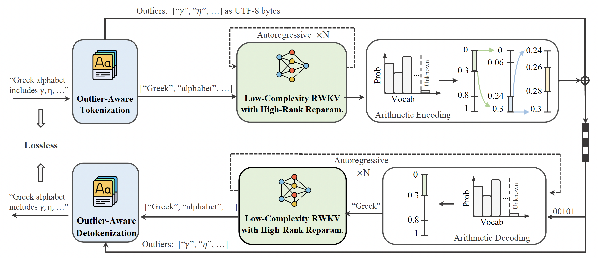

# L3TC: Leveraging RWKV for Learned Lossless Low-Complexity Text Compression [AAAI2025]

Official PyTorch implementation of the paper "L3TC: Leveraging RWKV for Learned Lossless Low-Complexity Text Compression".

## Abstract


Learning-based probabilistic models can be combined with an entropy coder for data compression. However, due to the high complexity of learning-based models, their practical application as text compressors has been largely overlooked. To address this issue, our work focuses on a low-complexity design while maintaining compression performance. We introduce a novel Learned Lossless Low-complexity Text Compression method (L3TC). Specifically, we conduct extensive experiments demonstrating that RWKV models achieve the fastest decoding speed with a moderate compression ratio, making it the most suitable backbone for our method. Second, we propose an outlier-aware tokenizer that uses a limited vocabulary to cover frequent tokens while allowing outliers to bypass the prediction and encoding. Third, we propose a novel high-rank reparameterization strategy that enhances the learning capability during training without increasing complexity during inference. Experimental results validate that our method achieves 48% bit saving compared to gzip compressor. Besides, L3TC offers compression performance comparable to other learned compressors, with a 50× reduction in model parameters. More importantly, L3TC is the fastest among all learned compressors, providing real-time decoding speeds up to megabytes per second.

## Requirements

```
pip install -r requirements.txt
```

## Data Preprocess
First, download enwik8 and enwik9 to data/public_text_dataset. Then run the following script to generate dictionary and train/val data.

```
python scripts/preprocessor.py
```

## Train the model

```
python main.py --output_dir work_dirs -c ./config/l3tc/l3tc_200k.py --save_log --amp
```

## Inference && Compression

```
python scripts/compressor.py \
    -c "./config/l3tc/l3tc_200k.py" \
    --pretrain_model_path "work_dirs/l3tc_200k_20241210_135843/checkpoint0019.pth" \
    --tokenizer "dictionary/vocab_enwik8_bpe_16384_0.999/spm_enwik8_bpe_16384_0.999.model" \
    --tmp_processed_dir "data/enwik9_results/l3tc_200k_bpe16k_enwik9" \
    --segment_length 2048 \
    --device cuda \
    --input_file "data/public_text_dataset/enwik9"
```
## L3TC Pretrained Models

The pretrained models of L3TC can be downloaded from [google drive](https://drive.google.com/file/d/1LibLdeHTi3Io0H-ZiYZ6AhYUYKUkOpXz/view?usp=drive_link).

## Citation

If you use our work, please consider citing:
```bibtex
@misc{zhang2024l3tcleveragingrwkvlearned,
      title={L3TC: Leveraging RWKV for Learned Lossless Low-Complexity Text Compression}, 
      author={Junxuan Zhang and Zhengxue Cheng and Yan Zhao and Shihao Wang and Dajiang Zhou and Guo Lu and Li Song},
      year={2024},
      eprint={2412.16642},
      archivePrefix={arXiv},
      primaryClass={cs.CL},
      url={https://arxiv.org/abs/2412.16642}, 
}
```

## Contact
If you have any questions, please create an issue on this repository or contact at junxuan.zjx@antgroup.com or zxcheng@sjtu.edu.cn (Corresponding Author).

## Acknowledgements
Our code is based on [BlinkDL](https://github.com/BlinkDL/RWKV-LM)
